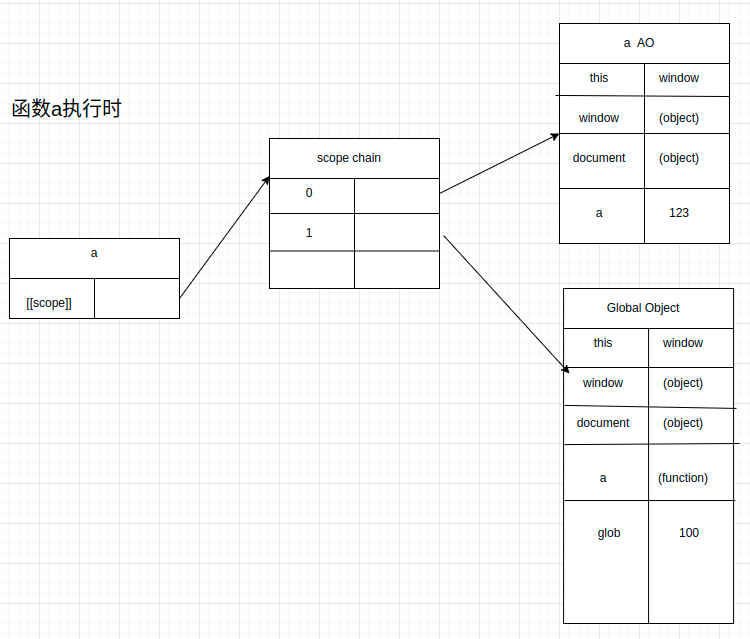
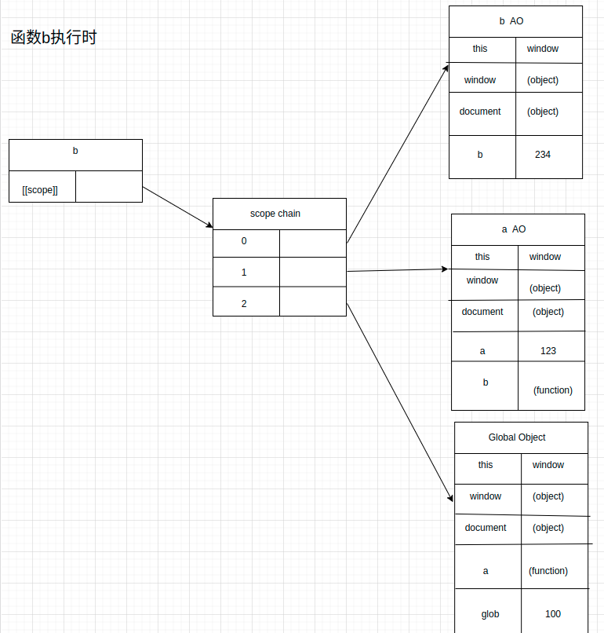

# 作用域链

## 前置概念

* 函数在执行时，会创建一个执行上下文的内部对象（Activation Object）

* (查找变量：从作用域链的顶端依次向下查找

* [[scope]]属性仅供js引擎获取，这个属性存储了执行上下文的集合

作用域链：[[scope]]中存储了执行上下文对象的集合，这个集合呈链式链接，称为作用域链。

## 例子解释

```javascript
  function a() {
    function b() {
      var b = 234;
    }

    var a = 123;
    b()
  }

  var glob = 100;
  a();

```




