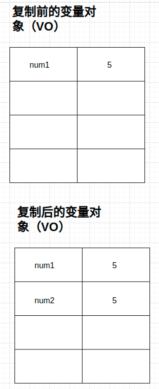
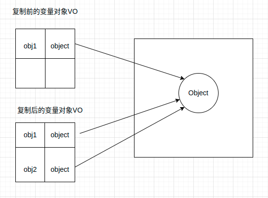

# 原始值与引用值

变量包含两种数据类型：原始值和引用值。

原始值：指基本类型数据（string, number, boolean, undefined, symbol, null）

引用值：由多个值构成的对象

## 变量访问

* 原始值
  * 存储在栈内存中
  * 按值访问

* 引用值
  * 存储在对内存中
  * 按引用访问（因为js不允许用户直接操作对象所在内存空间）

## 复制值

由于存储方式的不同，原始值与引用值通过变量复制时行为也有所不同

### 原始值复制

通过变量把一个原始值复制到另一个变量时，该值会创建一个副本存储到目标变量的栈内存中

```javascript
let num1 = 5
let num2 = num1
```




### 引用值复制

通过变量把引用值复制到另一个变量时，该值也会与原始值复制相似，区别在于，复制的引用值是一个指针。该指针指向堆内存中的对象。复制完成后，两个变量实际指向同一个对象，因此该对象的变化会体现在所有指向该对象的变量上。




## 传递参数

JS中，所有函数的参数都是按值传递的，（意味着传参的行为与复制值（原始值，引用值）的行为一致）。

先说明按值传递与按引用传递的特点

按值传递：修改形参不会影响实参

按引用传递：修改形参会影响实参


## 原始值传参
在对于原始值的传递中，不会产生太多疑惑

```javascript

let num1 = 1;

function addOne(num) {
  num += 1
  return num
}

addOne(num1) // 2

console.log(num1) // 1

```

## 引用值传参

记住引用值传参也是按值传递，行为与复制引用类型变量一致

```javascript
const user = {}

function setName(obj) {
  obj.name = 'renyinyu'
}

setName(user)
console.log(user) // { name: 'renyinyu' }
```


证明引用类型传参不是按引用传递（修改形参后，不会影响实参）
```javascript
const user = {}

function setName(obj) {
  obj.name = 'renyinyu'
  obj = new Object()
  obj.name = 'cj'
}

setName(user)
console.log(user) // { name: 'renyinyu' }
```
