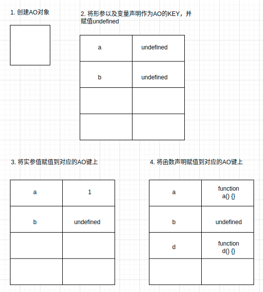

# 预编译 

## 函数预编译

函数预编译发生于函数执行的前一刻

预编译
1. 创建AO对象（执行上下文）
2. 将形参以及变量声明的名作为AO对象的Key，默认值为undefined
3. 将实参的值填充到对象AO的键
4. 将函数声明填充到AO对象上，值为函数声明的函数体

```javascript
// 练习（预编译过程参考下图）

function fn(a) {
  console.log(a) // 预编译结果： function a() {}

  var a = 123;

  console.log(a) // 123

  function a() {} // 在预编译期间已提升到作用域顶部

  console.log(a) // 123

  var b = function() {}

  console.log(b) // function() {}

  function d() {}
}

fn(1)

```


